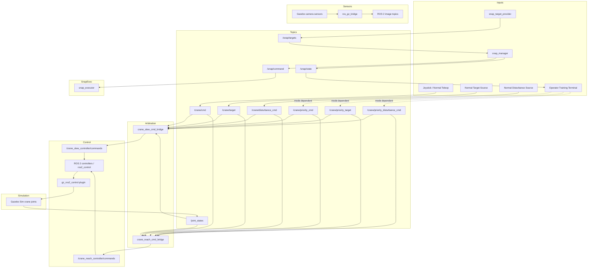

# ROS 2 Communication Pipeline

This document describes how commands, targets, disturbances, joint feedback, and Gazebo integration flow through the ROS 2 crane simulation.

## Overview

The crane control stack has two command lanes:

- Normal lane
  - Used by joystick and regular teleoperation
- Priority lane
  - Used by `teleop_operator_training`
  - Overrides the normal lane while priority messages are fresh

The arbitration happens inside the ROS 2 `crane_controller` nodes, not through topic collisions.

Recent communication and snap updates improved this pipeline in three important ways:

- Sim-facing nodes now use `use_sim_time`, so ROS 2 timers and freshness checks follow Gazebo time instead of host wall time
- Command and image topics now use explicit QoS profiles, reducing stale backlog and improving latest-sample behavior
- Snap selection is now limited to attachable container targets, matching what `snap_executor` can actually follow

## High-Level Flow

1. Input nodes publish normal or priority commands.
2. `crane_controller` bridges select the highest-priority fresh message.
3. The bridges convert normalized rate commands into absolute joint targets.
4. Those targets are sent to ROS 2 controllers.
5. `gz_ros2_control` forwards them into Gazebo Sim.
6. Gazebo publishes joint state feedback back into ROS 2.

## Mermaid Diagram

## Normal Topics

These topics are used for standard control:

- `/crane/cmd`
  - Normal `CraneCommand`
- `/crane/target`
  - Normal `CraneTarget`
- `/crane/disturbance_cmd`
  - Normal disturbance `CraneCommand`

Typical sources:

- `teleop_joy`
- other standard command or target publishers

The joystick path is the default operator input launched by `sim.launch.py`.

## Priority Topics

These topics are the priority control lane used by the terminal training and override tools:

- `/crane/priority_cmd`
- `/crane/priority_target`
- `/crane/priority_disturbance_cmd`

Typical sources:

- `teleop_operator_training`
  - `operator_training` mode publishes disturbance on the priority lane
  - `rate` mode publishes priority rate commands
  - `target` mode publishes priority targets

If a fresh priority message is available, the bridge uses it instead of the normal topic.

One important training detail:

- In `operator_training` mode, `teleop_operator_training` publishes disturbance on the priority disturbance lane while normal joystick control can still drive the crane
- In `rate` or `target` mode, the priority command or target lane overrides the normal lane while those messages remain fresh

## Command Arbitration

The two command bridge nodes are:

- `crane_slew_cmd_bridge`
  - Controls slew / yaw side of the crane
- `crane_reach_cmd_bridge`
  - Controls trolley, winch, sway joint, and dependent reach-side joints

They subscribe to both normal and priority topics and apply this rule:

1. Use a fresh priority target if present and enabled.
2. Otherwise use a fresh normal target if present and enabled.
3. If no target is active, use a fresh priority command if present.
4. Otherwise use a fresh normal command if present.
5. Disturbance is selected separately and added on top of the active rate command:
   - fresh enabled priority disturbance overrides normal disturbance
   - otherwise fresh enabled normal disturbance is added

If priority input times out, control automatically falls back to the normal lane.

## Sim Time

The main simulation launch now enables `use_sim_time` on sim-facing nodes such as:

- crane control bridges
- joystick and training teleop nodes
- ship DP / wave node
- snap manager, executor, and target provider
- camera dashboard and bridge nodes
- `robot_state_publisher`

Why this helps:

- command freshness timeouts are now measured against Gazebo time
- timer-driven nodes behave more consistently during pause, slow-motion, or startup delay
- ROS 2 state estimation and feedback loops stay aligned with the simulator clock

The launch also bridges `/clock` from Gazebo into ROS 2 so these nodes all share the simulator time source.

## QoS Strategy

The project no longer relies on the generic shorthand queue depth `10` for the main communication paths.

Current intent:

- command-like topics use explicit `KEEP_LAST(1)` and `RELIABLE`
- joystick and image streams use sensor-data QoS
- latched container pose uses transient-local reliable QoS

Why this helps:

- old operator commands are dropped instead of being replayed late
- camera views prefer the newest frame over stale buffered frames
- snap and training state updates stay deterministic without building unnecessary queue backlog

## ROS 2 to Gazebo Bridge

There are two different bridge concepts in this system:

### 1. Application-Level Command Bridge

The Python `crane_controller` nodes act as command bridges between high-level operator input and low-level joint commands.

They:

- subscribe to commands, targets, disturbances, and joint states
- arbitrate between normal and priority inputs
- integrate rate commands into target positions
- enforce limits and error guards
- apply mimic rules
- publish joint command arrays

In the current launch, the command bridge is split into two node instances:

- `crane_slew_cmd_bridge` for boom yaw
- `crane_reach_cmd_bridge` for trolley, winch, sway, drum, and wire-visual joints

### 2. Gazebo / ROS 2 Control Bridge

The Gazebo plugin `gz_ros2_control` is the simulation bridge between ROS 2 controllers and Gazebo physics.

It:

- exposes simulated joints to ROS 2 control
- receives controller commands from ROS 2
- applies those commands to Gazebo joints
- returns joint state feedback back into ROS 2

Control path:

`teleop / training node` -> `crane_controller` -> `ros2_control controllers` -> `gz_ros2_control` -> `Gazebo joints`

Feedback path:

`Gazebo joints` -> `gz_ros2_control` -> `/joint_states` -> `crane_controller`

## Joint State Feedback

`/joint_states` is used by the bridge nodes to:

- initialize internal target positions
- hold uncommanded joints at measured values
- compute sway-aware braking
- enforce target error limits

This feedback loop is what keeps command generation aligned with the actual simulated crane state.

## Operator Training Behavior

`teleop_operator_training` now uses the priority lane, so it can deliberately override normal operator input.

It also listens on `/crane/training_command`, which allows training scenarios to be triggered externally in addition to terminal input.

Examples:

- Priority rate command overrides joystick rate command
- Priority target overrides normal target source
- Priority disturbance overrides normal disturbance source

For payload training:

- `gusty_wind` only becomes active when the payload is attached according to `/snap/state`
- the wind disturbance is applied to payload sway behavior rather than directly commanding crane base motion

## Camera Bridge

Camera topics use a separate bridge path:

- Gazebo camera sensors publish Gazebo transport image topics
- `ros_gz_bridge` converts them to ROS 2 image topics

So:

- crane motion control uses `gz_ros2_control`
- cameras and sensor image transport use `ros_gz_bridge`

Recent camera tuning:

- ROS 2 image subscribers and dashboard output now use sensor-data QoS
- this reduces visible lag caused by queued frames during heavy lifting or rendering load
- the hook camera mount was also moved slightly upward to improve payload framing while hoisting

This does not eliminate every dropped frame under load, but it makes the camera feed fresher and more useful to the operator.

## Snap Notes

The snap workflow remains training-oriented hook-follow behavior rather than a rigid physics weld, but it was cleaned up to behave more predictably.

Recent snap-related changes:

- `enable_snap` now defaults to `true` in the main launch
- `snap_target_provider` still publishes both ship and container targets for training context
- the manager only selects attachable container targets by default
- snapped hook clearance was reduced so the payload hangs closer to the hook
- the temporary visible snap-hitbox marker on the container was hidden while the logical hitbox stayed active

Why this helps:

- avoids selecting ship targets that the current executor cannot attach
- makes hook-to-container alignment look more natural during lift-off
- keeps the operator view cleaner without removing the snap assist logic

Current attach path:

- `snap_manager` detects when the hook is inside a candidate area and publishes a `SnapCommand`
- `snap_executor` accepts container targets and repositions the container with Gazebo set-pose / remove / spawn services
- attached payload motion is therefore driven by repeated pose updates, not by a simulated rigid joint constraint

## Summary

The pipeline can be viewed as:

1. Input layer
   - joystick
   - operator training terminal
2. Arbitration layer
   - priority topics override normal topics
3. Control layer
   - ROS 2 controllers and command bridges
4. Simulation layer
   - Gazebo via `gz_ros2_control`
5. Feedback layer
   - joint states, snap state, HMI range state, and camera bridges
